# Mind & Body Yoga Studio
Live link to the website: [Mind and Body](https://frirsta.github.io/yoga-studio/)

## Features

### Home

### about
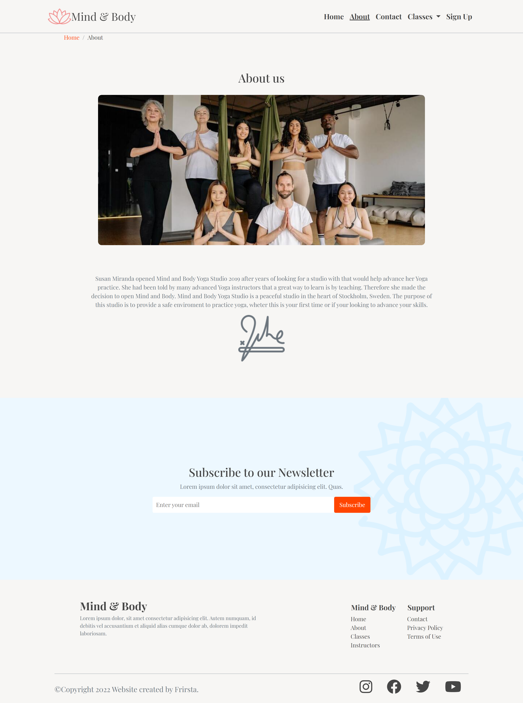
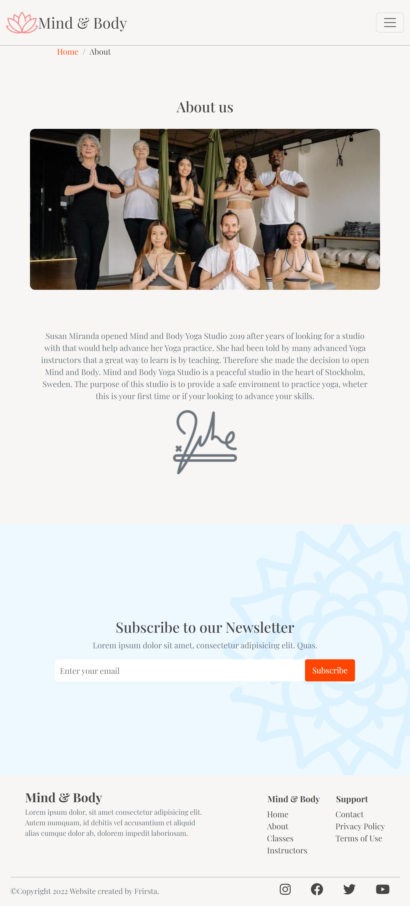
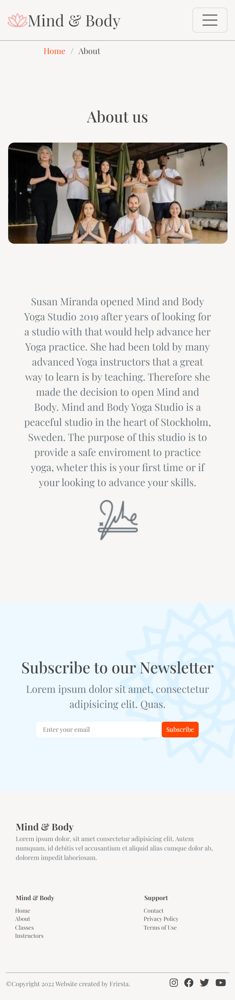

### class
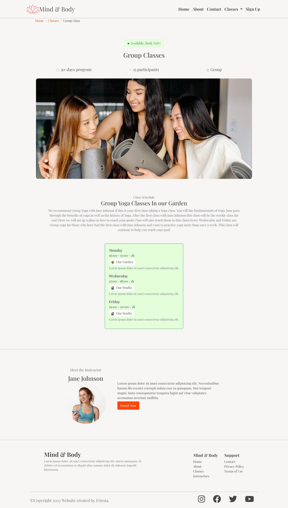
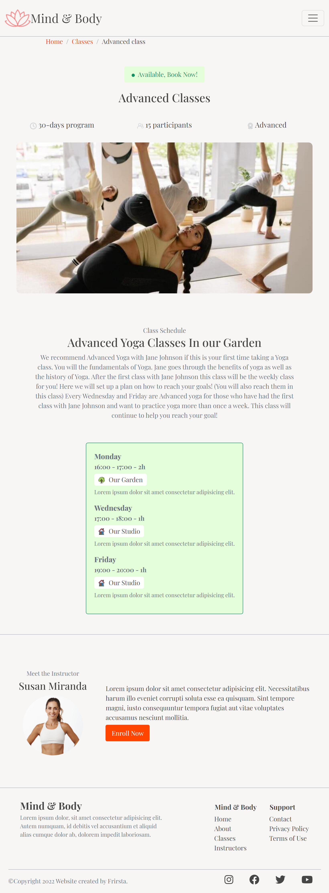
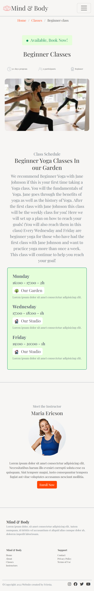

### contact
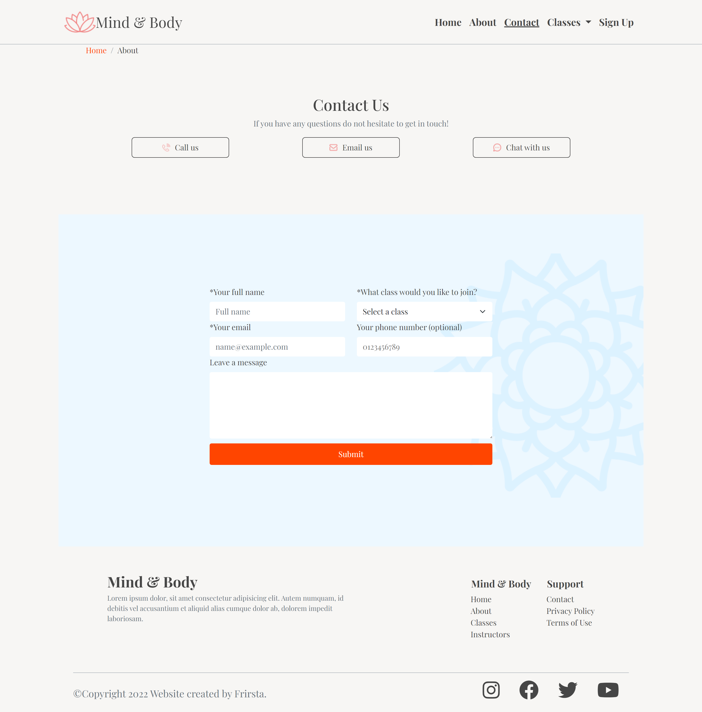
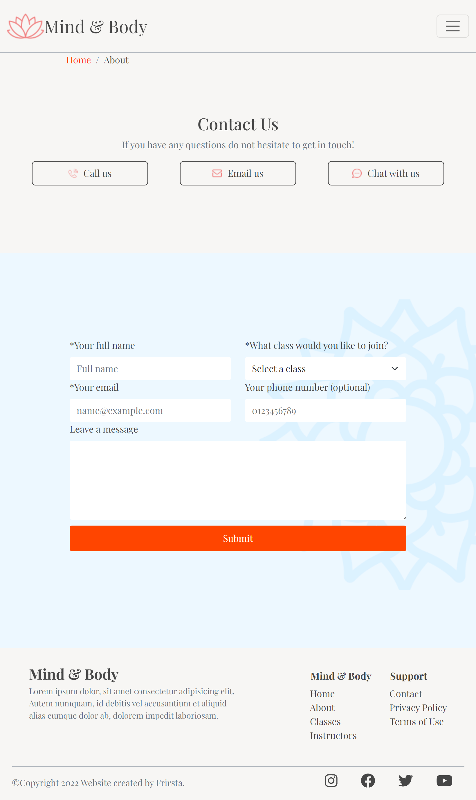
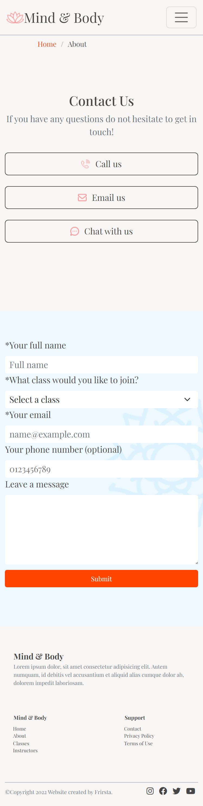

### signup
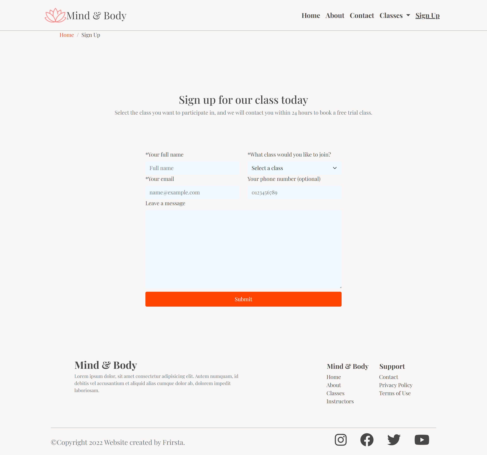
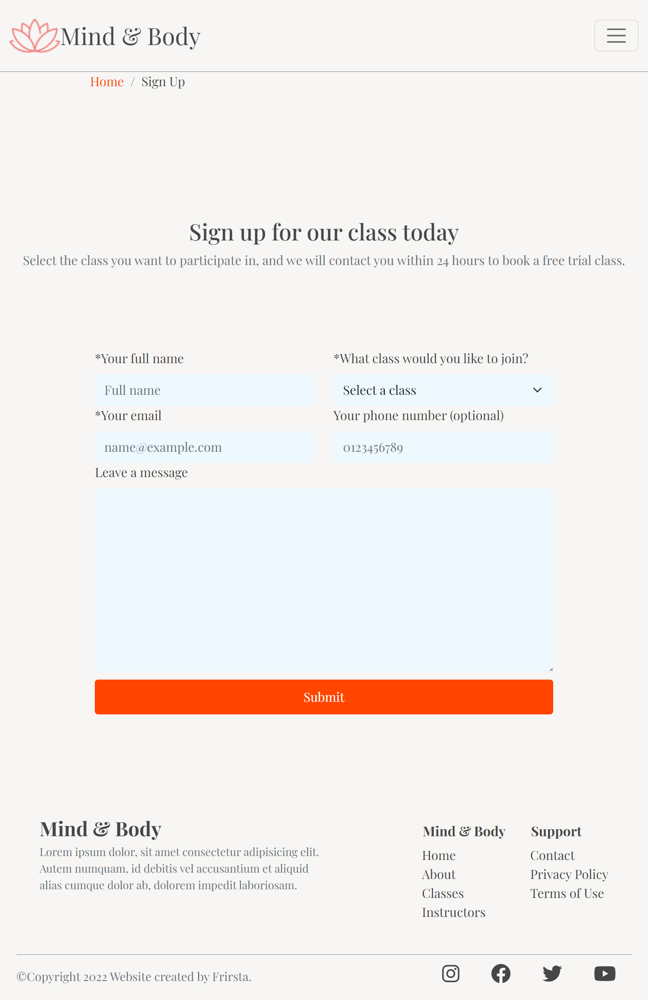
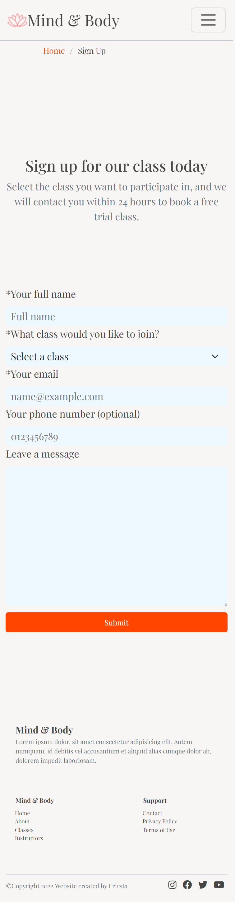

### contact
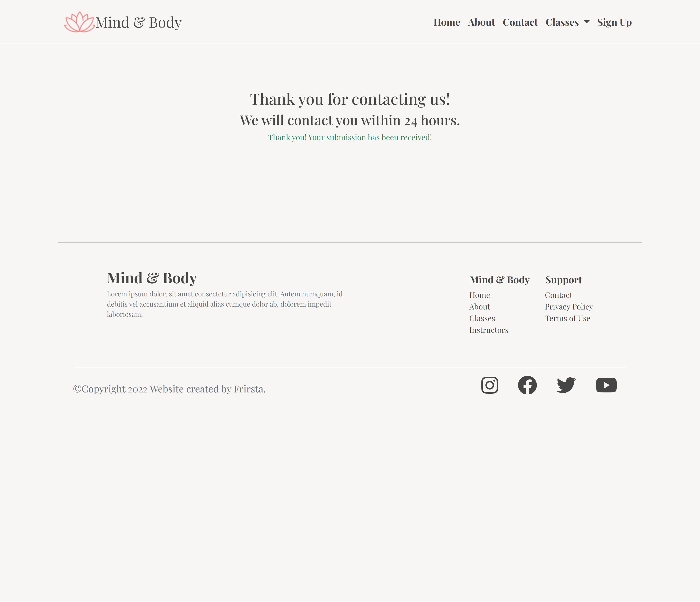
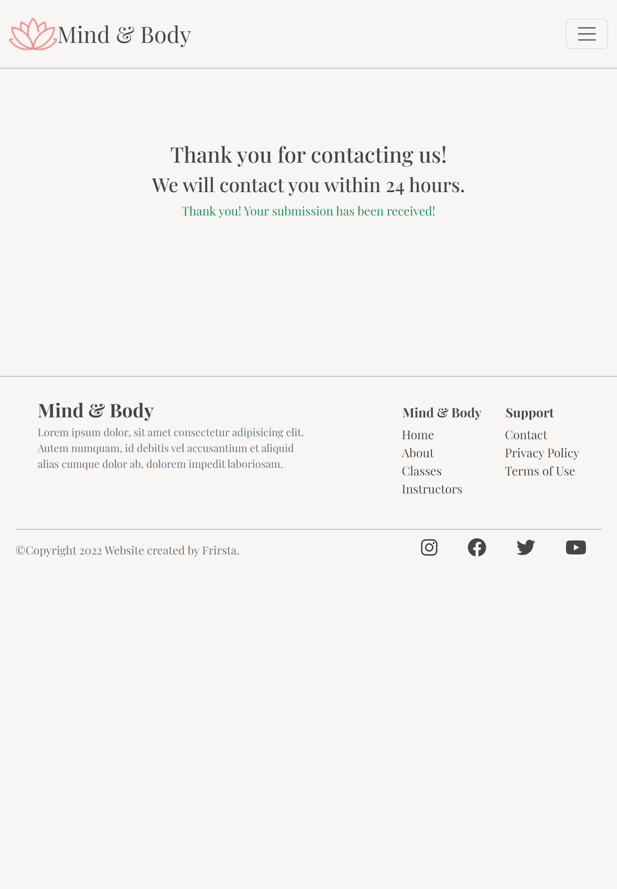
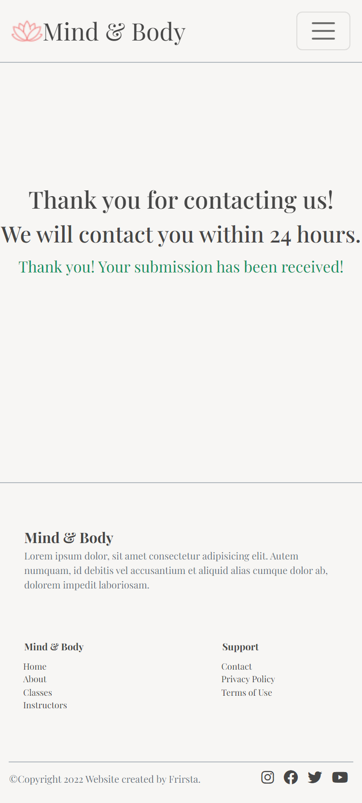

Hobby project

## Technologies
* Bootstrap
* HTML
* CSS

## Sources

ABOUT US:
Photo by Yan Krukau: https://www.pexels.com/photo/people-posing-at-the-camera-8436402/

Icon by <a href="https://freeicons.io/profile/103766">Satawat Foto Anukul</a> on <a href="https://freeicons.io">freeicons.io</a>                           
Icon by <a href="https://freeicons.io/profile/102253">dDara</a> on <a href="https://freeicons.io">freeicons.io</a>
king , dancer , pose , ii , yoga icon                           
Icon by <a href="https://freeicons.io/profile/102253">dDara</a> on <a href="https://freeicons.io">freeicons.io</a>
half , boat , pose , yoga icon
Icon by <a href="https://freeicons.io/profile/102253">dDara</a> on <a href="https://freeicons.io">freeicons.io</a>
head , to , knee , pose , yoga icon
Icon by <a href="https://freeicons.io/profile/102253">dDara</a> on <a href="https://freeicons.io">freeicons.io</a>
eight , angle , pose , yoga icon
Icon by <a href="https://freeicons.io/profile/102253">dDara</a> on <a href="https://freeicons.io">freeicons.io</a>
archer , pose , yoga icon
Icon by <a href="https://freeicons.io/profile/101226">Supalerk laipawat</a> on <a href="https://freeicons.io">freeicons.io</a>
                                
<a href="https://www.flaticon.com/free-icons/yoga" title="yoga icons">Yoga icons created by Freepik - Flaticon</a>

INSTRUCTORS
<a href="https://www.freepik.com/free-photo/smiling-young-spportswoman-shows-thumbs-up-motivated-fitness-woman-like-something-giving-compliment-recommending-sport-gym-white-background_23280366.htm#query=yoga&position=8&from_view=author">Image by cookie_studio</a> on Freepik INSTRUCTOR

<a href="https://www.freepik.com/free-photo/smiling-redhead-sportswoman-with-headphones-listening-music-doing-fitness-workout-holding-smartphone-hand-standing-against-white-background_24445872.htm#query=yoga&position=3&from_view=author">Image by cookie_studio</a> on Freepik INSTRUCTOR

<a href="https://www.freepik.com/free-photo/confident-sportswoman-white-sportsbra-holding-hands-waist-fitness-trainer-standing-power-pose-workout-gym-white-background_24482314.htm#query=fitness&position=2&from_view=search&track=sph">Image by cookie_studio</a> on Freepik INSTRUCTOR

ABOUT US
Bild av Tima Miroshnichenko: https://www.pexels.com/sv-se/foto/man-kvinna-hangmatta-student-6582867/ 

<a href="https://www.flaticon.com/free-icons/mandala" title="mandala icons">Mandala icons created by Freepik - Flaticon</a>
<a href="https://www.flaticon.com/free-icons/flower" title="flower icons">Flower icons created by Freepik - Flaticon</a>

CONTACT ICONS
<a href="https://www.flaticon.com/free-icons/phone" title="phone icons">Phone icons created by Freepik - Flaticon</a>
<a href="https://www.flaticon.com/free-icons/email" title="email icons">Email icons created by Freepik - Flaticon</a>
<a href="https://www.flaticon.com/free-icons/message" title="message icons">Message icons created by Freepik - Flaticon</a>

Bild av Yan Krukau: https://www.pexels.com/sv-se/foto/man-manniskor-kvinnor-traning-8436626/

<a href="https://www.flaticon.com/free-icons/clock" title="clock icons">Clock icons created by Those Icons - Flaticon</a> CLASSES

<a href="https://www.flaticon.com/free-icons/people" title="people icons">People icons created by Dreamstale - Flaticon</a>
<a href="https://www.flaticon.com/free-icons/medal" title="medal icons">Medal icons created by Freepik - Flaticon</a>

<a href="https://www.flaticon.com/free-icons/home" title="home icons">Home icons created by Freepik - Flaticon</a>
<a href="https://www.flaticon.com/free-icons/tree" title="tree icons">Tree icons created by Freepik - Flaticon</a>

    Bild av Yan Krukau: https://www.pexels.com/sv-se/foto/manniskor-kondition-yoga-halsa-8436620/ CLASSES
    Bild av Yan Krukau: https://www.pexels.com/sv-se/foto/vanner-kvinnor-lycklig-leende-8436550/ CLASSES
    
 Icons made by <a href="https://www.freepik.com" title="Freepik"> Freepik </a> from <a href="https://www.flaticon.com/" title="Flaticon">www.flaticon.com'</a>

<a href="https://www.flaticon.com/free-icons/lotus" title="lotus icons">Lotus icons created by Freepik - Flaticon</a> FAVICON
<a href="https://www.flaticon.com/free-icons/signature" title="signature icons">Signature icons created by Freepik - Flaticon</a> ABOUT

    
    Image by rawpixel.com
    <a href="https://www.freepik.com/free-photo/young-women-yoga-indoors-keep-calm-meditates-while-practicing-yoga-explore-inner-peace-yoga-meditation-have-good-benefits-health-photo-concept-yoga-sport-healthy-lifestyle_1253639.htm#query=yoga&position=16&from_view=search&track=sph">Image by tirachard</a> on Freepik HERO